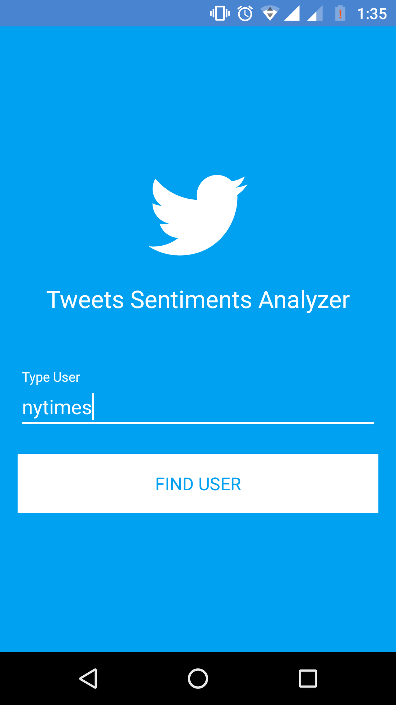
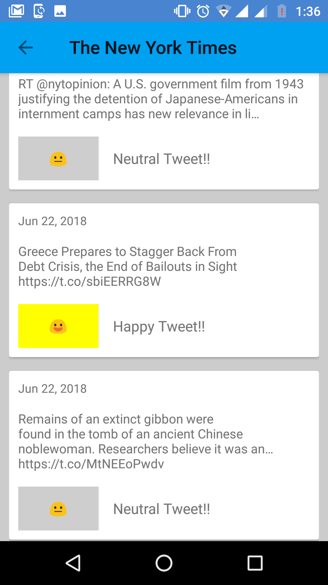

# Tweet Sentiments Analyzer

  
  
  

You can try it out from this <a href="https://drive.google.com/file/d/1CcF4o62o3o_9ALt8fInO4HXqy1pT5rKY/view?usp=sharing">link here!</a>

This app list tweets from one user you search, list its info and tweets and analyze each tweet sentiment.
It uses:

-Kotlin

-MVVM

-Android Archtecture with LiveData and ViewModels

-EmojiCompat

-RX

-Twitter's oficial API (https://developer.twitter.com) to fetch user's tweets

-Google's Natural Language API (https://cloud.google.com/natural-language/) for sentimental analysis.

-Instrumented tests with Espresso

-Unit tests with JUnit and Mockito

